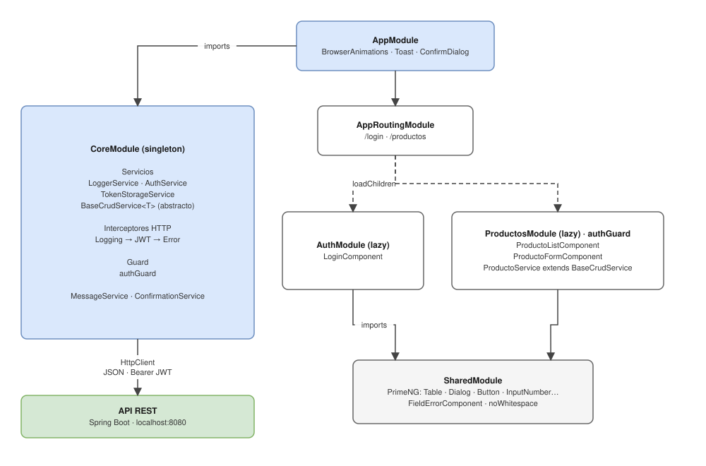
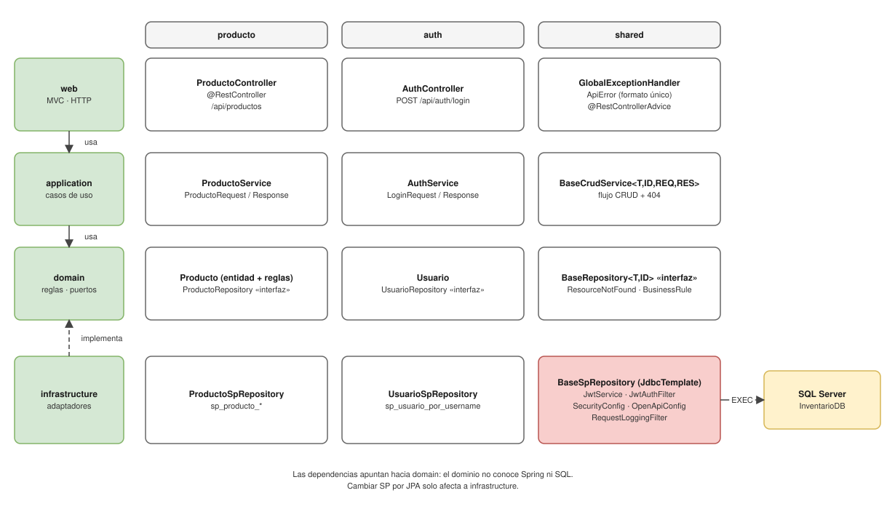
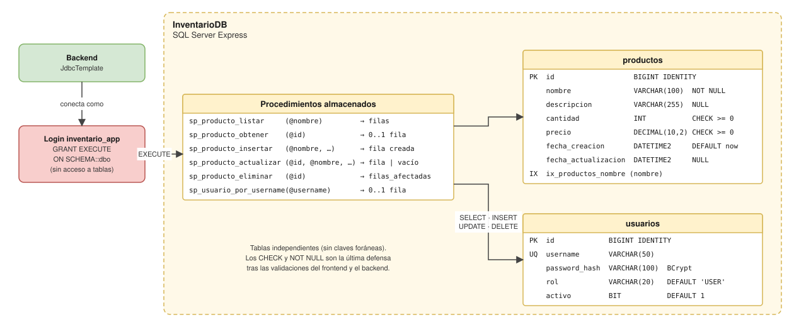

# Instalación
  ## Requisitos previos
  
  | Herramienta        | Versión               | Verificar                        |
  |--------------------|-----------------------|----------------------------------|
  | JDK 8 (Temurin 8)  | 1.8.x                 | `java -version` → `1.8.x`        |
  | Maven *(opcional)* | 3.6.3+                | `mvn -v` → `Java version: 1.8`   |
  | Node.js            | 18.19+, 20.11+ o 22   | `node -v`, `npm -v`              |
  | SQL Server Express | 2019, 2022 o 2025     | —                                |
  | SSMS               | Última versión        | —                                |
  | Chrome / Postman   | —                     | —                                |

## Pasos

1. **Base de datos**: ver [DB-Install](./Documentos/DB-Install.docx)
2. **Backend**: ver [Backend-Install](./Documentos/Backend-Install.docx)
3. **Frontend**: ver [Frontend-Install](./Documentos/Frontend-Install.docx)

> Seguir el orden indicado: el backend depende de la base de datos y el frontend del backend.

## Desarrollo (`dev`)

| Capa     | Comando                                                  |
|----------|----------------------------------------------------------|
| Frontend | `ng serve`                                               |
| Backend  | `.\mvnw.cmd spring-boot:run -Dspring-boot.run.profiles=dev` |

# Arquitectura 

## Frontend

## Backend

## Base de datos

## Implementation
Fase 1.-
La estructura base de cada capa se implementó siguiendo los diagramas de [Arquitectura](#arquitectura), en un commit por capa:

| Capa          | Commit                                                              | Contenido                                                                 |
|---------------|---------------------------------------------------------------------|---------------------------------------------------------------------------|
| Frontend      | [`f224665`](https://github.com/DiegoWojak/NOMBRE-REPO/commit/f224665) | Vistas, clases, interfaces y servicios que replican el modelo front |
| Backend       | [`4883988`](https://github.com/DiegoWojak/NOMBRE-REPO/commit/4883988) | Jerarquía de clases según el diagrama y extensiones base      |
| Base de datos | [`11a3d07`](https://github.com/DiegoWojak/NOMBRE-REPO/commit/11a3d07) | Creación de la BD, tablas, datos iniciales para el backend y procedures   

Sin problemas de compilación

Fase 2.- 
Consiste en amendar conexiones y requerimientos siguiendo el orden Base de datos &rarr; Backend &rarr; Frontend
